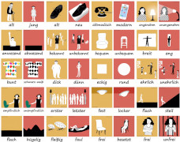
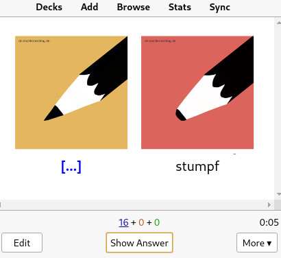

# 200 wichtigsten deutschen Adjektive

A collection of tools for downloading and processing adjective-pictures from
deutschlernerblog.de.

## Background

I use [Anki](https://apps.ankiweb.net/) flashcards to learn languages. I noticed
that deutschlernerblog.de has a collection of 100 images representing
adjectives, and I thought that they would make for good flashcards: the images
look good and placing opposite words side-by-side makes it easy to create a
clear flashcard.

## Overview

This repo consists of:

* `tools/` &ndash; is a collection of generic tools for scraping and processing
  the adjective images.
* `test/` and `testdata/` &ndash; automatic testing suite for `tools/`
* `gists/` &ndash; a script that uses `tools/` to transform images in `images/`
  into Anki notes.

The intended result is to transform the adjective images:

into

## For Developers

### Development shell

For development comfort, this project  uses Pipenv to manage dependencies and
the dev environment. Before each dev session run

    psh

to activate a dev subshell. The subshell configures shell and python
environments for this project.

### Unit testing

Run

    testall

to run this project's static type checker and unit tests.
